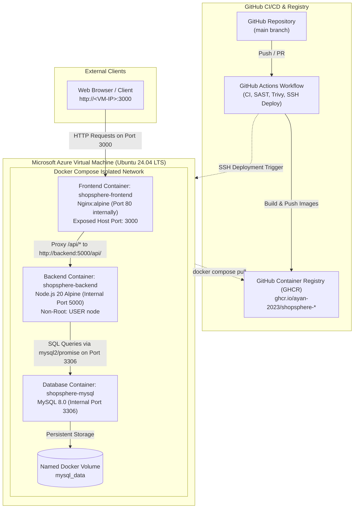
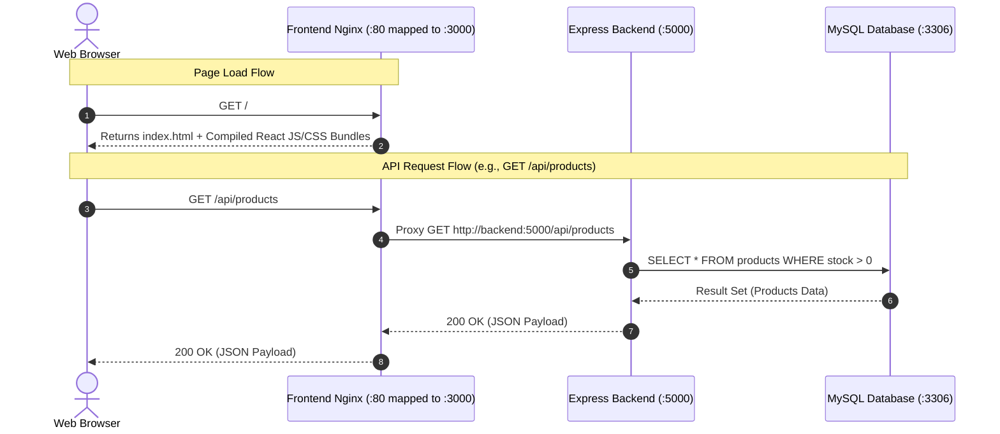
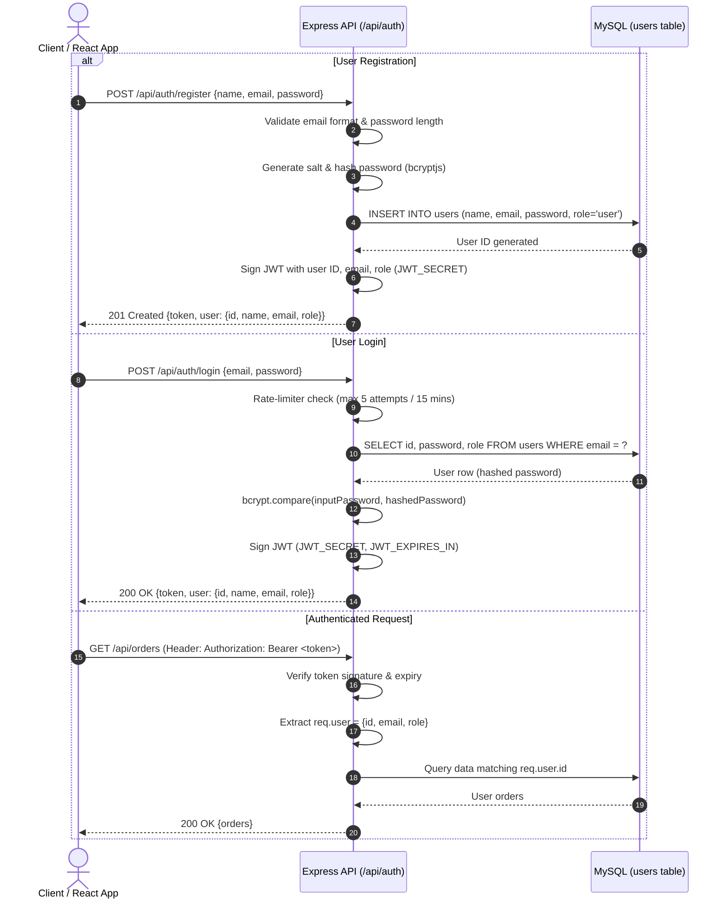
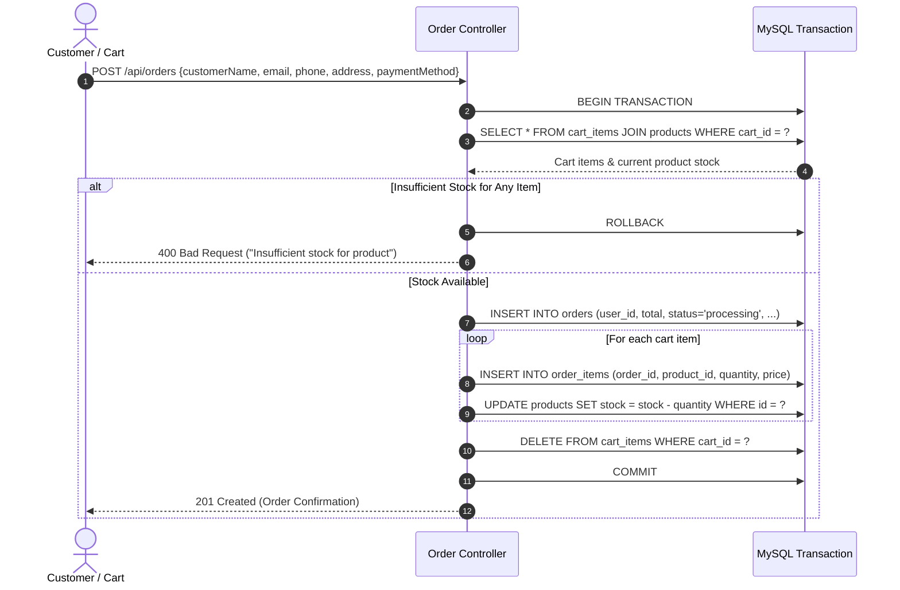
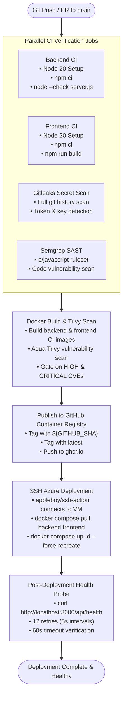
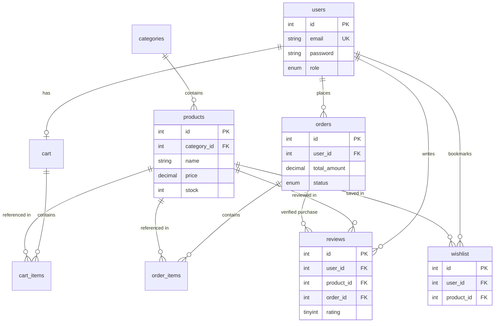

# 🏗️ ShopSphere — System Architecture

Welcome to the architectural specification for **ShopSphere**, a production-style, containerized, three-tier e-commerce web platform and DevSecOps deployment ecosystem. This document describes the system architecture, component relationships, network topologies, request lifecycles, and security boundaries implemented in this repository.

---

## 1. Architecture Overview

ShopSphere is engineered following a decoupled, three-tier microservice-inspired architecture:

1. **Presentation Layer (Frontend)**: A Single Page Application (SPA) built with React 18 and Vite, compiled into static production assets and served through an Nginx Alpine reverse proxy.
2. **Application Layer (Backend)**: A stateless RESTful API built with Node.js and Express.js, providing business logic, authentication, input validation, and role-based access control.
3. **Persistence Layer (Database)**: An ACID-compliant MySQL 8.0 relational database with transactional integrity, relational foreign keys, unique constraint guarantees, and volume-backed persistence.

The entire workload is containerized using **Docker** and orchestrated via **Docker Compose** within an isolated container network. The production deployment runs on a **Microsoft Azure Virtual Machine** powered by **Ubuntu 24.04 LTS**. Nginx serves as the sole reverse proxy and public entry point (exposed on port `3000`), routing API traffic internally to the Express backend container on port `5000`, while the database and backend remain unexposed to the public internet.

---

## 2. High-Level Architecture

The following diagram illustrates both the runtime request traffic and the automated continuous integration/continuous delivery (CI/CD) delivery flow onto the Azure infrastructure:



---

## 3. Application Layers

### Frontend Layer
- **Core Technologies**: React 18, Vite, Lucide React, React Router DOM.
- **Web Server & Delivery**: Nginx Alpine container serving optimized static assets (`HTML`, `JS`, `CSS`).
- **Client-Side Routing**: SPA routing with history fallback (`try_files $uri $uri/ /index.html`).
- **Capabilities**:
  - Catalog browsing, keyword search, price range filtering, category navigation, and sorting.
  - Stateful shopping cart management with real-time quantity validation.
  - Customer wishlist bookmarking with duplicate prevention.
  - Multi-step checkout with address, phone, and pincode validation.
  - Customer authentication (registration and login with JWT session storage).
  - Customer profile and chronological order tracking dashboard.
  - Dedicated administrative dashboard for sales statistics, inventory updates, and order status transitions.

### Backend Layer
- **Core Technologies**: Node.js 20, Express.js 4.
- **API Style**: RESTful JSON API exposing structured `/api/*` endpoints.
- **Authentication & Security**:
  - Stateless JSON Web Token (`jsonwebtoken`) verification for protected routes.
  - Cryptographic password hashing using `bcryptjs`.
  - Role-Based Access Control (`role = 'admin'`) for administrative routes.
  - Authentication brute-force mitigation using `express-rate-limit` (5 requests per 15-minute window).
  - Strict input sanitization and payload validation on checkout, product creation, and reviews.
- **Core APIs**:
  - `/api/auth`: Registration, login, current user profile.
  - `/api/products`: Product listing, filtering, pagination, details, and admin CRUD.
  - `/api/categories`: Category taxonomy.
  - `/api/cart`: User cart retrieval, item addition, quantity modification, item removal.
  - `/api/orders`: Order creation, user order history, order status updates.
  - `/api/reviews`: Verified purchase product reviews.
  - `/api/wishlist`: Bookmark management.
  - `/api/admin`: Dashboard metrics and aggregate analytics.
  - `/api/health`: Health monitoring endpoint.

### Database Layer
- **Database Engine**: MySQL 8.0 Community Server.
- **Database Name**: `shopsphere`.
- **Relational Tables**:
  - `users`: User identity, credential hashes, roles (`user`, `admin`).
  - `categories`: Store catalog classification taxonomy.
  - `products`: Product catalog, pricing, discounts, ratings, and active stock levels.
  - `cart`: One-to-one user shopping cart container.
  - `cart_items`: Cart items with composite uniqueness (`cart_id`, `product_id`).
  - `orders`: Order headers storing customer delivery details, total amount, payment method, and status.
  - `order_items`: Line-item snapshots capturing product ID, quantity, and historical purchase price.
  - `reviews`: Customer product feedback with rating constraints (1–5) and verified purchase linkages.
  - `wishlist`: Customer product bookmarks with unique composite keys (`user_id`, `product_id`).
- **Responsibilities**:
  - Provides ACID compliance for all business transactions.
  - Enforces relational referential integrity via cascade rules (`ON DELETE CASCADE`, `ON DELETE SET NULL`).
  - Isolates concurrent checkout requests to prevent overselling inventory.

---

## 4. Docker Architecture 🐳

The container topology is declared in [docker-compose.yml](file:///e:/DevOps%20Coding/shopsphere-ecommerce/docker-compose.yml) and encompasses three coordinated services:

| Container Service | Base Image | Internal Port | Host Port | Privilege / User | Public Access |
| :--- | :--- | :--- | :--- | :--- | :--- |
| `shopsphere-mysql` | `mysql:8.0` | `3306` | None | `mysql` | ❌ No (Internal only) |
| `shopsphere-backend` | `node:20-alpine` | `5000` | None | `node` (UID 1000) | ❌ No (Internal only) |
| `shopsphere-frontend` | `nginx:alpine` | `80` | `3000` (via `${FRONTEND_PORT}`) | `nginx` | ✅ Yes (Public ingress) |

### MySQL Container (`shopsphere-mysql`)
- **Image**: `mysql:8.0`.
- **Persistence**: Backed by a named Docker volume (`mysql_data`) mounted to `/var/lib/mysql`.
- **Initialization**: Automatically mounts `./database/schema.sql` into `/docker-entrypoint-initdb.d/schema.sql:ro` during initial container boot.
- **Healthcheck**: Uses `mysqladmin ping -h localhost -uroot -p${MYSQL_ROOT_PASSWORD}` with a 5-second interval, 5-second timeout, and 10 retries.
- **Network Isolation**: The MySQL container does not bind to any host ports; it communicates strictly over the Docker Compose default bridge network.

### Backend Container (`shopsphere-backend`)
- **Image**: `ghcr.io/ayan-2023/shopsphere-backend:latest` (built via multi-stage Dockerfile).
- **Runtime Environment**: Node.js 20 on Alpine Linux.
- **Security Hardening**:
  - Stage 1 installs production dependencies (`npm ci --omit=dev`).
  - Stage 2 copies only production `node_modules` into the runtime container.
  - Package manager binaries are removed from the image (`rm -rf /usr/local/lib/node_modules/npm`) to reduce container footprint and eliminate runtime package installation vectors.
  - Execution runs under unprivileged `USER node`.
- **Internal Networking**: Listens on internal port `5000`. Resolves the database host using the Docker Compose service name `mysql` (`DB_HOST=mysql`, `DB_PORT=3306`).
- **Startup Sequencing**: Configured with `depends_on` requiring `mysql` to achieve a `service_healthy` condition before starting.

### Frontend Container (`shopsphere-frontend`)
- **Image**: `ghcr.io/ayan-2023/shopsphere-frontend:latest` (built via multi-stage Dockerfile).
- **Runtime Environment**: Nginx on Alpine Linux.
- **Port Mapping**: Container port `80` is published to host port `3000` (`${FRONTEND_PORT}:80`).
- **Role**: Serves as the sole public gateway. Requests for frontend pages are resolved from static build files; requests directed to `/api/*` are reverse-proxied to the backend container.
- **Startup Sequencing**: Configured with `depends_on` requiring `backend` to achieve `service_started`.

> [!NOTE]
> HTTPS/TLS termination is not currently configured at the container level; traffic arrives over plain HTTP on port `3000`.

---

## 5. Nginx Reverse Proxy 🔀

The frontend container embeds a custom [nginx.conf](file:///e:/DevOps%20Coding/shopsphere-ecommerce/frontend/nginx.conf) that unifies presentation and API routing:

```nginx
server {
    listen 80;
    server_name _;

    root /usr/share/nginx/html;
    index index.html;

    location /api/ {
        proxy_pass http://backend:5000/api/;
        proxy_http_version 1.1;
        proxy_set_header Host $host;
        proxy_set_header X-Real-IP $remote_addr;
        proxy_set_header X-Forwarded-For $proxy_add_x_forwarded_for;
        proxy_set_header X-Forwarded-Proto $scheme;
    }

    location / {
        try_files $uri $uri/ /index.html;
    }

    location /images/ {
        try_files $uri =404;
    }
}
```

### Why Docker Service Name `backend` Works:
Docker Compose automatically provisions an internal user-defined bridge network and sets up an embedded DNS resolver at `127.0.0.11`. When Nginx evaluates `http://backend:5000/api/`, the embedded DNS server resolves the service name `backend` to the private IP address dynamically assigned to `shopsphere-backend` within the Docker network.

### Routing Logic:
1. **/api/***: Requests matching `/api/` are forwarded directly to the Express backend container at port `5000`. Standard proxy headers (`Host`, `X-Real-IP`, `X-Forwarded-For`, `X-Forwarded-Proto`) preserve client metadata.
2. **/**: React Single Page Application routing. If a physical file matching `$uri` exists (e.g., `.js`, `.css`, favicon), Nginx serves it directly. If no file matches (such as client-side route `/orders`), Nginx falls back to `/index.html`, allowing `react-router-dom` to render the correct view on the client.
3. **/images/**: Serves local static image assets, returning an HTTP `404` if the requested file is missing.

---

## 6. Request Flow 🔄

When a client accesses `http://<VM-IP>:3000`, the following sequence executes across the infrastructure:



---

## 7. Authentication Flow 🔐

ShopSphere implements a stateless, token-based authentication architecture using JSON Web Tokens (JWT) and `bcryptjs` password hashing. Tokens are transmitted via the HTTP `Authorization: Bearer <token>` header, rather than cookies.



### Authentication Architectural Rules:
- **No Plaintext Passwords**: Passwords are encrypted with `bcryptjs` before insertion into MySQL.
- **Self-Assignment Protection**: The registration controller enforces `role = 'user'`. Public clients cannot assign themselves the `admin` role.
- **Rate-Limiting**: The `/api/auth` router is protected by `authLimiter` allowing a maximum of 5 requests per 15-minute window per IP to prevent brute-force attacks.
- **Admin Verification**: Administrative routes pass through an `admin` middleware verifying that the decoded JWT contains `role === 'admin'`.

---

## 8. Data Flow for Orders 🛒

The checkout and order management workflow uses relational database transactions (`connection.beginTransaction()`) to ensure inventory consistency:



### Order Lifecycle & Immutability Rules:
1. **Pre-Order Validation**: Stock is checked when adding an item to the cart and re-verified atomically inside the transaction during checkout.
2. **Order Cancellation & Stock Restoration**:
   - When an order transitions to `cancelled`, a database transaction reads all line items from `order_items` and increments product inventory back into `products.stock`.
   - Repeated cancellation attempts evaluate the current status and exit without restoring inventory twice.
3. **Delivered Order Protection**: Orders marked `delivered` are permanent. The backend explicitly rejects updates or cancellations for completed orders (`Delivered orders cannot be updated.`).

---

## 9. CI/CD Architecture 🚀

The automated deployment pipeline is defined in [.github/workflows/ci-cd.yml](file:///e:/DevOps%20Coding/shopsphere-ecommerce/.github/workflows/ci-cd.yml):



### Published Artifacts:
- **Backend Image**: `ghcr.io/ayan-2023/shopsphere-backend:latest` and `ghcr.io/ayan-2023/shopsphere-backend:${GITHUB_SHA}`
- **Frontend Image**: `ghcr.io/ayan-2023/shopsphere-frontend:latest` and `ghcr.io/ayan-2023/shopsphere-frontend:${GITHUB_SHA}`

---

## 10. Deployment Architecture ☁️

The application runtime is hosted on a single **Microsoft Azure Virtual Machine**:

- **Operating System**: Ubuntu 24.04 LTS.
- **Container Engine**: Docker Engine with Docker Compose v2.
- **Deployment Path**: `/home/devopsadmin/shopsphere-ecommerce`.
- **Public Ingress**: Port `3000` mapped to Nginx port `80`.
- **Automated Rollout Mechanism**:
  1. The GitHub Actions runner initiates an SSH session to the Azure VM using `appleboy/ssh-action`.
  2. Runs `docker compose pull backend frontend` to fetch newly built images from GHCR.
  3. Recreates application containers via `docker compose up -d --force-recreate backend frontend`.
  4. Runs a retry loop against `http://localhost:3000/api/health` (12 attempts with 5-second sleep intervals) to confirm service health before exiting successfully.

> [!NOTE]
> The current ShopSphere deployment utilizes Docker Compose on a single Ubuntu VM. Kubernetes (AKS), Azure Container Registry (ACR), Azure Database for MySQL, and Terraform are not part of the active runtime deployment.

---

## 11. Security Architecture 🛡️

ShopSphere incorporates automated DevSecOps scanning and runtime security controls:

### Implemented Controls:
- **Secret Detection**: `gitleaks-action` scans all commits in the pull request and push history for leaked credentials.
- **Static Application Security Testing (SAST)**: `semgrep-action` executes automated checks with the `p/javascript` ruleset to detect vulnerable patterns.
- **Container Vulnerability Gating**: Aqua Security's `trivy-action` scans both backend and frontend images, halting builds if unmitigated `HIGH` or `CRITICAL` vulnerabilities exist.
- **Stateless Authentication**: Signed JSON Web Tokens validated on protected routes.
- **Password Protection**: Passwords salted and hashed with `bcryptjs`.
- **Role-Based Access Control**: Strict segregation between standard customer routes and administrative endpoints.
- **Rate-Limiting**: Express middleware limits authentication endpoints to 5 attempts per 15-minute window.
- **SQL Injection Defense**: Relational queries execute via parameterized statements in `mysql2/promise`.
- **Least Privilege Runtime**: Backend container drops privileges to `USER node`.
- **Minimal Attack Surface**: Build tools and package managers (`npm`) are stripped from the backend production container.
- **Port Isolation**: Database and backend containers expose no host ports and are accessible solely within the internal Docker Compose bridge network.
- **Secret Isolation**: Configuration secrets are loaded exclusively via server-side `.env` files and GitHub Actions Secrets; `.env` is ignored by Git.

---

## 12. Database Architecture 🗄️

The relational database architecture is defined in [database/schema.sql](file:///e:/DevOps%20Coding/shopsphere-ecommerce/database/schema.sql):



### Enforced Constraints:
- `users`: `UNIQUE KEY (email)` prevents duplicate account registrations.
- `cart`: `UNIQUE KEY (user_id)` ensures a single active cart per customer.
- `cart_items`: `UNIQUE KEY (cart_id, product_id)` ensures distinct items within a cart.
- `wishlist`: `UNIQUE KEY (user_id, product_id)` prevents duplicate bookmarking.
- `reviews`: `UNIQUE KEY (user_id, product_id, order_id)` restricts reviews to one per purchased order, and `CONSTRAINT chk_reviews_rating CHECK (rating >= 1 AND rating <= 5)` validates ratings.

---

## 13. Environment Configuration ⚙️

Configuration is decoupled from application code and injected via environment variables:

```
[ .env Configuration File / GitHub Secrets ]
    │
    ├── Database Credentials:
    │   ├── MYSQL_ROOT_PASSWORD   (Root database administrator password)
    │   ├── MYSQL_DATABASE        (Default schema name: shopsphere)
    │   ├── DB_USER               (Application-level database user)
    │   └── DB_PASSWORD           (Application-level database password)
    │
    ├── Authentication Parameters:
    │   ├── JWT_SECRET            (Signing secret for auth tokens)
    │   └── JWT_EXPIRES_IN        (Token lifespan: e.g., 7d)
    │
    └── Network Ingress Ports:
        ├── BACKEND_PORT          (Express internal binding: 5000)
        ├── FRONTEND_PORT         (Host mapped port: 3000)
        └── MYSQL_PORT            (Internal database port: 3306)
```

No secrets or passwords are committed to source control; sample defaults are maintained in [.env.example](file:///e:/DevOps%20Coding/shopsphere-ecommerce/.env.example) for local development reference.

---

## 14. Architecture Design Principles

1. **Separation of Concerns**: Independent tiers for UI presentation, business operations, and persistence.
2. **Container Isolation**: Workloads run in dedicated containers communicating exclusively over private virtual bridge networks.
3. **Principle of Least Privilege**: Unprivileged runtime users (`USER node`) and restricted administrative routes.
4. **Data Durability**: Persistence managed via named Docker volumes surviving container recreation cycles.
5. **Shift-Left DevSecOps**: Early gating via automated secret scans, SAST, and container vulnerability scans before deployment.
6. **Post-Deployment Health Verification**: Automated endpoint validation to confirm availability before completing the CI/CD pipeline.

---

## 15. Current Architecture Limitations

To maintain architectural transparency, the current implementation has the following documented boundaries:

- **HTTP Ingress**: The application currently serves traffic over plain HTTP on port `3000`. HTTPS/TLS encryption and domain certificates are not configured.
- **Permissive CORS**: The backend CORS middleware currently allows `origin: '*'` to simplify multi-port communication.
- **Single-Host Topology**: Containers are hosted on a single Azure VM using Docker Compose rather than a distributed container orchestrator.
- **Self-Hosted Database**: MySQL runs in a container on the host VM rather than an Azure-managed database service (e.g., Azure Database for MySQL Flexible Server).
- **Static Ingress Routing**: Traffic routes directly to the VM's public IP on port `3000` without an external Azure Application Gateway or cloud load balancer.

---

## 16. Future Architecture Improvements 🚀

The following roadmap items represent potential architectural enhancements:

- [ ] **HTTPS / TLS Ingress**: Configure Let's Encrypt TLS certificates using Certbot or an Azure Application Gateway.
- [ ] **Custom Domain Routing**: Point a production DNS record (e.g., `api.shopsphere.com` and `shopsphere.com`) to ingress controllers.
- [ ] **Managed Relational Storage**: Migrate database storage to Azure Database for MySQL Flexible Server for automated backups and failover.
- [ ] **Centralized Secret Management**: Store and rotate credentials using Azure Key Vault or HashiCorp Vault.
- [ ] **Kubernetes Migration**: Migrate Docker Compose services to Azure Kubernetes Service (AKS) using Helm charts.
- [ ] **Observability & Monitoring**: Implement Prometheus metrics scraping and Grafana dashboards for container resource tracking.
- [ ] **Centralized Logging**: Stream container logs into Grafana Loki or Azure Log Analytics.
- [ ] **Zero-Downtime Deployments**: Implement blue-green or rolling container updates behind an Nginx reverse proxy or cloud load balancer.

---

## 17. Architecture Summary

**ShopSphere** integrates modern full-stack development with a continuous security and deployment lifecycle:

$$\text{React 18} + \text{Node.js / Express} + \text{MySQL 8.0} + \text{Nginx} + \text{Docker Compose} + \text{GitHub Actions} + \text{GHCR} + \text{Azure VM}$$

By combining multi-stage Docker builds, shift-left security tooling (Gitleaks, Semgrep, Trivy), and an automated SSH deployment pipeline with health checks, ShopSphere represents a resilient, production-style cloud application ready for modern DevOps environments.
