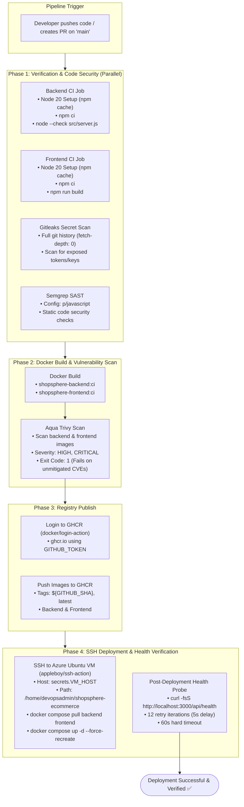

# 🚀 ShopSphere — CI/CD Pipeline Documentation

This document provides a comprehensive technical overview of the automated Continuous Integration, Continuous Delivery (CI/CD), and DevSecOps deployment pipeline implemented for **ShopSphere**.

The entire automation lifecycle is configured through **GitHub Actions** in [.github/workflows/ci-cd.yml](file:///e:/DevOps%20Coding/shopsphere-ecommerce/.github/workflows/ci-cd.yml).

---

## 1. Overview

ShopSphere uses GitHub Actions to automate software delivery and quality assurance from code commit to cloud production. The pipeline automates:

- **Application Continuous Integration (CI)**: Validates runtime dependencies, builds production assets, and checks syntax for frontend and backend codebases.
- **Shift-Left Security Analysis**: Scans commit history for leaked secrets (Gitleaks) and evaluates application code against static vulnerability rulesets (Semgrep).
- **Hardened Container Image Building**: Constructs production container images for the backend and frontend microservices.
- **Container Vulnerability Scanning**: Audits built container images against CVE databases using Aqua Trivy, failing builds on unmitigated `HIGH` or `CRITICAL` findings.
- **Artifact Publishing**: Pushes cryptographically tagged and versioned container images to the **GitHub Container Registry (GHCR)**.
- **Automated Cloud Rollout**: Connects securely to an Azure Ubuntu 24.04 Virtual Machine over SSH to pull the latest images and recreate services.
- **Automated Health Verification**: Polls the live application health endpoint with exponential retry logic to confirm application stability before completing deployment.

The pipeline is triggered automatically on `push` and `pull_request` events targeting the `main` branch.

---

## 2. CI/CD Pipeline Architecture

The workflow consists of modular, parallelized jobs that enforce security and verification gates before artifacts are published or deployed:



---

## 3. GitHub Actions Jobs

The workflow file [.github/workflows/ci-cd.yml](file:///e:/DevOps%20Coding/shopsphere-ecommerce/.github/workflows/ci-cd.yml) defines five primary jobs:

### Job 1: `backend-ci`
- **Runner**: `ubuntu-latest`
- **Working Directory**: `backend`
- **Objective**: Ensures backend code dependencies install cleanly and source files are free of syntax errors.
- **Steps**:
  1. `actions/checkout@v4`: Checks out repository files.
  2. `actions/setup-node@v4`: Configures Node.js version `20` with npm dependency caching keyed to `backend/package-lock.json`.
  3. `npm ci`: Performs clean, deterministic installation of dependencies based strictly on `package-lock.json`.
  4. `node --check src/server.js`: Runs Node.js syntax parsing on the backend server entry point to catch syntax errors without starting the server.

### Job 2: `frontend-ci`
- **Runner**: `ubuntu-latest`
- **Working Directory**: `frontend`
- **Objective**: Verifies frontend dependencies and guarantees the production bundle builds without errors.
- **Steps**:
  1. `actions/checkout@v4`: Checks out repository files.
  2. `actions/setup-node@v4`: Configures Node.js version `20` with npm dependency caching keyed to `frontend/package-lock.json`.
  3. `npm ci`: Installs exact frontend build and runtime dependencies.
  4. `npm run build`: Executes the Vite production build (`vite build`), validating JSX compilation and generating `/dist`.

### Job 3: `gitleaks` (Secret Scanning)
- **Runner**: `ubuntu-latest`
- **Objective**: Detects accidentally committed credentials, private keys, database passwords, or third-party API tokens.
- **Steps**:
  1. `actions/checkout@v6`: Checks out the complete commit history using `fetch-depth: 0`.
  2. `gitleaks/gitleaks-action@v3`: Executes Gitleaks against all historical commits using `${{ secrets.GITHUB_TOKEN }}`. If any secret pattern is matched, the job fails, halting further pipeline progression.

### Job 4: `semgrep` (SAST)
- **Runner**: `ubuntu-latest`
- **Objective**: Performs Static Application Security Testing (SAST) on JavaScript source code.
- **Steps**:
  1. `actions/checkout@v4`: Checks out repository files.
  2. `semgrep/semgrep-action@v1`: Runs Semgrep security analysis using the curated `p/javascript` ruleset (`with: config: p/javascript`). Scans for common vulnerabilities such as insecure deserialization, prototype pollution, and unsafe evaluations.

### Job 5: `docker-security` (Build, Scan, Push, Deploy)
- **Runner**: `ubuntu-latest`
- **Objective**: Orchestrates container creation, vulnerability auditing, GHCR publishing, SSH cloud rollout, and live health verification in an unbroken sequence.
- **Key Steps**:
  1. Checkout repository.
  2. Build temporary local CI Docker images for backend and frontend.
  3. Scan both images with Aqua Trivy.
  4. Authenticate to GitHub Container Registry (`ghcr.io`).
  5. Tag and push versioned images (`${GITHUB_SHA}` and `latest`).
  6. Connect over SSH to the Azure VM via `appleboy/ssh-action`.
  7. Pull newly pushed images and recreate containers.
  8. Execute automated health check verification.

---

## 4. Docker Image Build 🐳

Before images are published to any public or private registry, they are built locally on the GitHub Actions runner with local CI tags:

```bash
# Build backend container image
docker build -t shopsphere-backend:ci ./backend

# Build frontend container image
docker build -t shopsphere-frontend:ci ./frontend
```

### Build Characteristics:
- **Backend Build**: Executes the multi-stage build defined in `backend/Dockerfile`. Installs only production dependencies (`--omit=dev`), updates Alpine base packages, removes `npm` binaries, and assigns `USER node`.
- **Frontend Build**: Executes `frontend/Dockerfile`. Uses Node 20 to run `npm run build`, then copies the compiled assets from `/app/dist` into an `nginx:alpine` image with custom `nginx.conf`.
- **Local Tagging**: Using the temporary tag `:ci` ensures that images can be audited for CVEs by Trivy in the runner filesystem before exposing them to the container registry.

---

## 5. Container Security Scanning 🛡️

Image security gating is performed by **Aqua Security Trivy** (`aquasecurity/trivy-action@master`) directly on the runner.

### Trivy Configuration for Backend:
```yaml
- name: Scan backend image with Trivy
  uses: aquasecurity/trivy-action@master
  with:
    image-ref: shopsphere-backend:ci
    format: table
    exit-code: '1'
    ignore-unfixed: true
    severity: CRITICAL,HIGH
```

### Trivy Configuration for Frontend:
```yaml
- name: Scan frontend image with Trivy
  uses: aquasecurity/trivy-action@master
  with:
    image-ref: shopsphere-frontend:ci
    format: table
    exit-code: '1'
    ignore-unfixed: true
    severity: CRITICAL,HIGH
```

### Scanning Options Explained:
- `image-ref`: References the locally built image tag (`shopsphere-backend:ci` and `shopsphere-frontend:ci`).
- `format: table`: Formats findings into an easy-to-read ASCII table in the GitHub Actions runner console log.
- `exit-code: '1'`: Forces the action step to exit with code `1` (failing the pipeline) if any matching vulnerability is detected.
- `ignore-unfixed: true`: Excludes unpatched upstream vulnerabilities that do not yet have an official vendor fix, preventing false-positive pipeline breaks while strictly gating on fixable security holes.
- `severity: CRITICAL,HIGH`: Restricts the gate strictly to High and Critical CVEs.

### Why Container Scanning Precedes Image Publishing:
Scanning images before pushing prevents vulnerable or compromised artifacts from ever reaching the registry (`ghcr.io`). This guarantees that only validated, compliant images are distributed to cloud servers or local developer workstations.

---

## 6. GitHub Container Registry 📦

Images that pass Trivy security verification are authenticated, tagged, and pushed to **GitHub Container Registry (GHCR)**:

### Registry Authentication:
Authentication uses the official Docker login action with GitHub's automatic ephemeral workflow token:
```yaml
- name: Log in to GitHub Container Registry
  uses: docker/login-action@v3
  with:
    registry: ghcr.io
    username: ${{ github.actor }}
    password: ${{ secrets.GITHUB_TOKEN }}
```

### Published Image Repositories:
- **Backend API**: `ghcr.io/ayan-2023/shopsphere-backend`
- **Frontend Web**: `ghcr.io/ayan-2023/shopsphere-frontend`

### Tagging Strategy:
```bash
IMAGE_OWNER=$(echo "${GITHUB_REPOSITORY_OWNER}" | tr '[:upper:]' '[:lower:]')

# Tagging Backend
docker tag shopsphere-backend:ci ghcr.io/$IMAGE_OWNER/shopsphere-backend:${GITHUB_SHA}
docker tag shopsphere-backend:ci ghcr.io/$IMAGE_OWNER/shopsphere-backend:latest

# Tagging Frontend
docker tag shopsphere-frontend:ci ghcr.io/$IMAGE_OWNER/shopsphere-frontend:${GITHUB_SHA}
docker tag shopsphere-frontend:ci ghcr.io/$IMAGE_OWNER/shopsphere-frontend:latest
```

### Tagging Benefits:
- **`${GITHUB_SHA}` (Immutable Commit Tag)**: Provides traceability. Every build is permanently tied to the exact Git commit SHA that generated it, enabling rollbacks to specific historical releases.
- **`latest` (Active Release Tag)**: Enables zero-reconfiguration deployment on the Azure host VM via `docker compose pull backend frontend`.

---

## 7. GitHub Actions Permissions 🔐

The workflow defines minimal, explicit repository permissions at the top of [.github/workflows/ci-cd.yml](file:///e:/DevOps%20Coding/shopsphere-ecommerce/.github/workflows/ci-cd.yml):

```yaml
permissions:
  contents: read
  packages: write
```

### Permission Scopes Explained:
- `contents: read`: Grants read access to repository code and commit history, allowing checkout actions to clone files for CI tests, Gitleaks, and Semgrep.
- `packages: write`: Grants permission to create, tag, and push new container images to GitHub Packages / GitHub Container Registry (`ghcr.io`).

---

## 8. Azure VM SSH Deployment ☁️

Cloud deployment executes via the `appleboy/ssh-action@v1.2.0` action, connecting directly to the Azure Ubuntu 24.04 Virtual Machine:

```yaml
- name: Deploy to Azure VM
  uses: appleboy/ssh-action@v1.2.0
  with:
    host: ${{ secrets.VM_HOST }}
    username: ${{ secrets.VM_USER }}
    key: ${{ secrets.VM_SSH_KEY }}
    script: |
      cd /home/devopsadmin/shopsphere-ecommerce
      docker compose pull backend frontend
      docker compose up -d --force-recreate backend frontend
      echo "Waiting for ShopSphere to become healthy..."
```

### Deployment Flow on the VM:
1. **Directory Navigation**: Enters `/home/devopsadmin/shopsphere-ecommerce` where production `docker-compose.yml` and server-side `.env` files reside.
2. **Pull Updated Images**: Fetches the newest `:latest` images for `backend` and `frontend` directly from GHCR.
3. **Container Recreation**: Runs `docker compose up -d --force-recreate backend frontend` to restart the application containers using the updated image layers while leaving the `shopsphere-mysql` container and its volume intact.

---

## 9. Post-Deployment Health Verification ❤️

To prevent deploying faulty containers without detection, the SSH deployment script executes an automated retry health check loop directly on the VM:

```bash
echo "Waiting for ShopSphere to become healthy..."

for i in {1..12}; do
  if curl -fsS http://localhost:3000/api/health; then
    echo "ShopSphere is healthy."
    exit 0
  fi

  echo "Health check failed. Retrying in 5 seconds..."
  sleep 5
done

echo "ShopSphere health check failed after 60 seconds."
exit 1
```

### Health Check Execution Parameters:
- **Target Endpoint**: `http://localhost:3000/api/health`
- **Total Iterations**: 12 attempts
- **Interval Delay**: 5 seconds between failed attempts
- **Total Timeout Threshold**: 60 seconds
- **Pass Condition**: `curl -fsS` returns HTTP status `200` with response payload `{"success":true,"message":"ShopSphere API is running"}`.
- **Fail Condition**: If all 12 attempts fail, the script echoes a failure message and exits with status `1`, causing the GitHub Actions job to report failure.

---

## 10. Required Secrets & Environment Variables 🔒

The pipeline relies on encrypted GitHub Repository Secrets to authenticate with external infrastructure:

| Secret Name | Purpose | Configuration Scope |
| :--- | :--- | :--- |
| `GITHUB_TOKEN` | Built-in GitHub Actions token used for Gitleaks scanning and GHCR login | Provided automatically by GitHub Actions runtime |
| `VM_HOST` | Public IP address or FQDN of the Azure Ubuntu Virtual Machine | Configured under Repository Secrets |
| `VM_USER` | Administrative SSH username on the Azure VM (e.g., `devopsadmin`) | Configured under Repository Secrets |
| `VM_SSH_KEY` | Private OpenSSH key authorized in the VM's `~/.ssh/authorized_keys` file | Configured under Repository Secrets |

> [!IMPORTANT]
> Application secrets such as database passwords (`DB_PASSWORD`, `MYSQL_ROOT_PASSWORD`) and `JWT_SECRET` are not passed through CI/CD. They reside exclusively in the server-side `/home/devopsadmin/shopsphere-ecommerce/.env` file on the Azure VM.

---

## 11. Pipeline Triggers & Branch Strategy 🌿

The workflow configuration defines the following trigger events:

```yaml
on:
  push:
    branches:
      - main
  pull_request:
    branches:
      - main
```

- **Push to `main`**: Executes full CI, security scanning, image build, registry push, Azure deployment, and health verification.
- **Pull Request to `main`**: Runs the pipeline against the proposed code changes to validate syntax, builds, and security posture prior to merging.

---

## 12. Failure Modes & Troubleshooting 🧯

| Pipeline Stage | Failure Cause | Diagnostic / Remediation Action |
| :--- | :--- | :--- |
| **Backend CI** | Syntax error or invalid package dependencies | Run `node --check src/server.js` and `npm ci` locally in `backend/` to identify the broken module or syntax. |
| **Frontend CI** | React JSX compilation or Vite build failure | Run `npm run build` locally in `frontend/` to review TypeScript/JSX errors or missing imports. |
| **Gitleaks** | Hardcoded secret or credential detected in Git history | Check job log for the specific commit hash and file path. Revoke the exposed credential immediately and use `git-filter-repo` to purge it from history. |
| **Semgrep SAST** | Insecure code pattern flagged by `p/javascript` | Inspect the reported line in the Semgrep log. Sanitize input or refactor the method according to Semgrep's remediation guidelines. |
| **Docker Build & Trivy** | Unfixed `HIGH` or `CRITICAL` vulnerability in base OS or npm package | Run `trivy image shopsphere-backend:ci` locally. Update the vulnerable library in `package.json` or update the base Alpine image. |
| **GHCR Push** | Insufficient permissions for container registry | Verify the workflow `permissions` block includes `packages: write`. Ensure image owner name is lowercased. |
| **SSH Deployment** | Connection refused, timeout, or bad SSH key | Verify `VM_HOST`, `VM_USER`, and `VM_SSH_KEY` in GitHub Secrets. Verify Azure NSG allows inbound SSH on port 22. |
| **Health Check Timeout** | Backend container crashed or cannot connect to MySQL | SSH into Azure VM and inspect container logs: `docker compose logs -t backend`. Verify database container health: `docker compose ps`. |

---

## 13. CI/CD Summary

The ShopSphere CI/CD pipeline establishes an automated, shift-left DevSecOps lifecycle:

$$\text{Git Push} \longrightarrow \text{Lint / Build CI} \longrightarrow \text{Gitleaks / Semgrep SAST} \longrightarrow \text{Trivy CVE Audit} \longrightarrow \text{GHCR Tagging} \longrightarrow \text{SSH Azure Deploy} \longrightarrow \text{Health Verification}$$

This pipeline ensures that every release deployed to production is tested for syntactic correctness, scanned for secrets and vulnerabilities, published to a container registry with commit traceability, and verified through live health probes.
