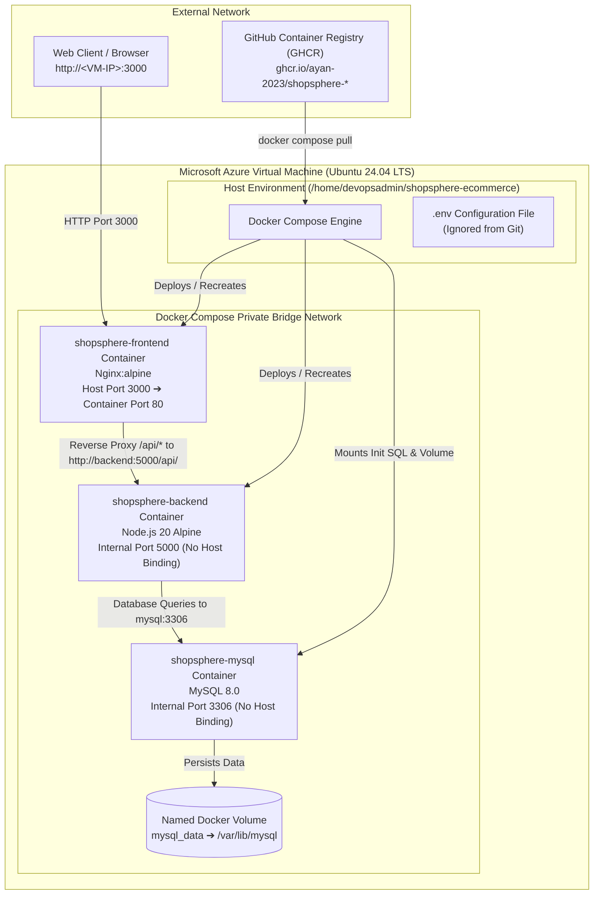

# ☁️ ShopSphere — Deployment Documentation

This document describes the cloud deployment architecture, server environment, container runtime, and operational procedures for **ShopSphere**.

---

## 1. Deployment Overview

ShopSphere is deployed on a dedicated cloud infrastructure using containerization:

- **Host Infrastructure**: Hosted on a single **Microsoft Azure Virtual Machine**.
- **Operating System**: **Ubuntu 24.04 LTS** (Long Term Support).
- **Container Platform**: **Docker Engine** and **Docker Compose v2** manage the multi-container lifecycle.
- **Database Engine**: **MySQL 8.0** runs as an isolated container with local volume-backed persistence.
- **Application Backend**: The **Node.js + Express** REST API runs inside a hardened Node 20 Alpine container.
- **Frontend & Ingress**: The **React 18** Single Page Application is served by **Nginx Alpine**, which acts as the sole public application entry point.
- **Network Boundaries**: Only the frontend container binds to an external host port (`3000`). The backend and MySQL containers are internal services confined to the private Docker Compose bridge network.
- **Image Distribution**: Pre-built, pre-scanned production images for the backend and frontend are pulled directly from **GitHub Container Registry (GHCR)**.

> [!NOTE]
> The current deployment serves web and API traffic over standard HTTP via port `3000`. HTTPS/TLS certificates and load balancers are not currently configured at the host level.

---

## 2. Deployment Architecture

The following diagram details the runtime container network, port mappings, and image delivery path on the Azure VM:



---

## 3. Azure VM Environment ☁️

The host virtual machine specifications and runtime configuration are as follows:

| Component | Specification |
| :--- | :--- |
| **Cloud Provider** | Microsoft Azure |
| **Virtual Machine OS** | Ubuntu 24.04 LTS |
| **Deployment User** | `devopsadmin` |
| **Application Directory** | `/home/devopsadmin/shopsphere-ecommerce` |
| **Container Engine** | Docker Engine `v24+` |
| **Orchestration Tool** | Docker Compose `v2+` |
| **Network Ingress** | Azure Network Security Group (NSG) allowing Port `22` (SSH) and Port `3000` (Web) |

> [!IMPORTANT]
> The server's public IP address, SSH private keys, and administrative credentials are confidential and must never be recorded in public documentation.

---

## 4. Repository Setup 📦

The application repository is cloned on the Azure VM at:
```bash
/home/devopsadmin/shopsphere-ecommerce
```

### Directory Contents on the Server:
```
/home/devopsadmin/shopsphere-ecommerce/
├── backend/                  # Backend Dockerfile & source files
├── database/
│   └── schema.sql            # Schema definitions & initial database seed data
├── frontend/                 # Frontend Dockerfile, Nginx config & source files
├── docker-compose.yml        # Service definitions & container network configuration
├── .env.example              # Sample environment variable template
└── .env                      # Server-side environment file (contains actual secrets)
```

The server-side `.env` file contains production secrets and configuration values. It is excluded from version control via `.gitignore` to prevent secret leakage.

---

## 5. Docker Images 🐳

Production container workloads run from version-controlled container images:

| Service | Image Reference | Image Source |
| :--- | :--- | :--- |
| **Frontend** | `ghcr.io/ayan-2023/shopsphere-frontend:latest` | Built, scanned with Trivy, and published to GHCR by GitHub Actions |
| **Backend** | `ghcr.io/ayan-2023/shopsphere-backend:latest` | Built, scanned with Trivy, and published to GHCR by GitHub Actions |
| **Database** | `mysql:8.0` | Official Oracle MySQL image from Docker Hub |

During automated deployments, GitHub Actions also publishes commit-specific SHA tags (`${GITHUB_SHA}`) alongside `latest` for auditing and rollback capabilities.

---

## 6. Docker Compose Services

The multi-container application stack is defined in [docker-compose.yml](file:///e:/DevOps%20Coding/shopsphere-ecommerce/docker-compose.yml):

### 1. MySQL Service (`shopsphere-mysql`)
```yaml
mysql:
  image: mysql:8.0
  container_name: shopsphere-mysql
  restart: unless-stopped
  environment:
    MYSQL_ROOT_PASSWORD: ${MYSQL_ROOT_PASSWORD}
    MYSQL_DATABASE: ${MYSQL_DATABASE}
    MYSQL_USER: ${DB_USER}
    MYSQL_PASSWORD: ${DB_PASSWORD}
  volumes:
    - mysql_data:/var/lib/mysql
    - ./database/schema.sql:/docker-entrypoint-initdb.d/schema.sql:ro
  healthcheck:
    test: ["CMD", "mysqladmin", "ping", "-h", "localhost", "-uroot", "-p${MYSQL_ROOT_PASSWORD}"]
    interval: 5s
    timeout: 5s
    retries: 10
```
- **Image**: `mysql:8.0`.
- **Initialization**: Mounts `./database/schema.sql` into `/docker-entrypoint-initdb.d/schema.sql` as read-only (`:ro`). On first startup, MySQL automatically executes this script to create tables and insert seed data.
- **Persistence**: Relational data is stored in the named volume `mysql_data`, mounted at `/var/lib/mysql`. Data persists across container restarts or recreations.
- **Healthcheck**: Uses `mysqladmin ping` every 5 seconds. The service transitions to `healthy` once MySQL accepts socket connections.
- **Network Isolation**: The MySQL container does not publish any ports to the VM host.

### 2. Backend Service (`shopsphere-backend`)
```yaml
backend:
  image: ghcr.io/ayan-2023/shopsphere-backend:latest
  container_name: shopsphere-backend
  restart: unless-stopped
  environment:
    PORT: 5000
    DB_HOST: mysql
    DB_PORT: 3306
    DB_USER: ${DB_USER}
    DB_PASSWORD: ${DB_PASSWORD}
    DB_NAME: ${MYSQL_DATABASE}
    JWT_SECRET: ${JWT_SECRET}
    JWT_EXPIRES_IN: ${JWT_EXPIRES_IN}
  depends_on:
    mysql:
      condition: service_healthy
```
- **Image**: `ghcr.io/ayan-2023/shopsphere-backend:latest`.
- **Internal Port**: Listens on port `5000`.
- **Database Connection**: Uses the Docker service name `mysql` as the hostname (`DB_HOST: mysql`), communicating over internal port `3306`.
- **Startup Sequencing**: Configured with `depends_on` requiring `mysql` to report `service_healthy` before the backend container starts.
- **Network Isolation**: No ports are published to the VM host.

### 3. Frontend Service (`shopsphere-frontend`)
```yaml
frontend:
  image: ghcr.io/ayan-2023/shopsphere-frontend:latest
  container_name: shopsphere-frontend
  restart: unless-stopped
  ports:
    - "${FRONTEND_PORT}:80"
  depends_on:
    backend:
      condition: service_started
```
- **Image**: `ghcr.io/ayan-2023/shopsphere-frontend:latest`.
- **Internal Port**: Nginx listens on port `80` inside the container.
- **Host Port Binding**: Mapped to host port `3000` via `${FRONTEND_PORT}:80`.
- **Startup Sequencing**: Waits for the `backend` container to reach `service_started` state.
- **Ingress Role**: Acts as the sole public gateway, serving static assets and reverse-proxying `/api/` traffic to `http://backend:5000/api/`.

---

## 7. Environment Configuration ⚙️

Configuration values are passed into containers using environment variables declared in `/home/devopsadmin/shopsphere-ecommerce/.env`:

| Variable | Description | Sample Placeholder Format |
| :--- | :--- | :--- |
| `MYSQL_ROOT_PASSWORD` | Password for the MySQL `root` administrator account | `<strong_root_password>` |
| `MYSQL_DATABASE` | Database name to create on initialization | `shopsphere` |
| `DB_USER` | Application-level MySQL user account | `shopsphere_app` |
| `DB_PASSWORD` | Password for the application MySQL user | `<strong_app_password>` |
| `JWT_SECRET` | Secret key used to sign and verify JSON Web Tokens | `<high_entropy_jwt_secret>` |
| `JWT_EXPIRES_IN` | Token expiration timespan | `7d` |
| `BACKEND_PORT` | Port for the Express backend server (internal) | `5000` |
| `FRONTEND_PORT` | Host port exposed on the Azure VM for web traffic | `3000` |
| `MYSQL_PORT` | Port for MySQL database service (internal) | `3306` |

### Database Host Resolution:
The application uses the Docker Compose service name `mysql` as the backend database host (`DB_HOST=mysql`). Docker's internal DNS automatically resolves this hostname to the internal IP address of the `shopsphere-mysql` container.

---

## 8. First-Time Deployment

To perform a clean, initial deployment of ShopSphere on a fresh Ubuntu 24.04 Azure VM:

### Step 1: Connect to the Azure VM
```bash
ssh devopsadmin@<AZURE_VM_HOST>
```

### Step 2: Install Docker & Docker Compose
Ensure Docker Engine and the Docker Compose plugin are installed:
```bash
sudo apt-get update
sudo apt-get install -y ca-certificates curl gnupg

# Add Docker's official GPG key
sudo install -m 0755 -d /etc/apt/keyrings
curl -fsSL https://download.docker.com/linux/ubuntu/gpg | sudo gpg --dearmor -o /etc/apt/keyrings/docker.gpg
sudo chmod a+r /etc/apt/keyrings/docker.gpg

# Add Docker repository
echo \
  "deb [arch=$(dpkg --print-architecture) signed-by=/etc/apt/keyrings/docker.gpg] https://download.docker.com/linux/ubuntu \
  $(. /etc/os-release && echo "$VERSION_CODENAME") stable" | \
  sudo tee /etc/apt/sources.list.d/docker.list > /dev/null

sudo apt-get update
sudo apt-get install -y docker-ce docker-ce-cli containerd.io docker-buildx-plugin docker-compose-plugin

# Allow devopsadmin to run Docker without sudo
sudo usermod -aG docker devopsadmin
newgrp docker
```

### Step 3: Clone the Repository
```bash
cd /home/devopsadmin
git clone https://github.com/ayan-2023/shopsphere-ecommerce.git
cd /home/devopsadmin/shopsphere-ecommerce
```

### Step 4: Configure Production Environment Variables
Create the server `.env` file from the example template:
```bash
cp .env.example .env
nano .env
```
Populate the file with secure production passwords and secrets.

### Step 5: Pull Production Images from GHCR
```bash
docker compose pull
```

### Step 6: Launch Application Services
Start all containers in detached mode:
```bash
docker compose up -d
```

### Step 7: Verify Service Status
```bash
docker compose ps
```
Ensure all services are running and `shopsphere-mysql` reports `(healthy)`.

---

## 9. Automated CI/CD Deployment Flow 🚀

Once first-time setup is complete, subsequent deployments are completely automated via the GitHub Actions CI/CD workflow:

```
[ Developer pushes to main ]
            │
            ▼
[ GitHub Actions Pipeline ]
  1. Validates Backend & Frontend CI
  2. Runs Gitleaks & Semgrep SAST
  3. Builds Docker images & scans with Trivy
  4. Pushes backend & frontend images to GHCR
            │
            ▼
[ SSH Action to Azure VM (appleboy/ssh-action) ]
  Host: ${{ secrets.VM_HOST }}
  User: ${{ secrets.VM_USER }}
  Key:  ${{ secrets.VM_SSH_KEY }}
            │
            ▼
[ Commands Executed on the VM ]
  cd /home/devopsadmin/shopsphere-ecommerce
  docker compose pull backend frontend
  docker compose up -d --force-recreate backend frontend
            │
            ▼
[ Live Health Check Loop ]
  Polls: curl -fsS http://localhost:3000/api/health
  12 retries with 5s delay (60s total timeout)
            │
            ▼
[ Deployment Confirmed Healthy ✅ ]
```

---

## 10. Verification & Health Monitoring ❤️

Verify the operational status of the running deployment:

### 1. Inspect Running Containers
```bash
docker compose ps
```
Expected output:
```
NAME                  IMAGE                                          STATUS              PORTS
shopsphere-mysql      mysql:8.0                                      running (healthy)   3306/tcp
shopsphere-backend    ghcr.io/ayan-2023/shopsphere-backend:latest    running             5000/tcp
shopsphere-frontend   ghcr.io/ayan-2023/shopsphere-frontend:latest   running             0.0.0.0:3000->80/tcp
```

### 2. Verify API Health Endpoint
```bash
curl -fsS http://localhost:3000/api/health
```
Expected JSON response:
```json
{
  "success": true,
  "message": "ShopSphere API is running"
}
```

### 3. Verify Nginx Frontend HTTP Response
```bash
curl -I http://localhost:3000
```
Expected response:
```http
HTTP/1.1 200 OK
Server: nginx/...
Content-Type: text/html
```

---

## 11. Maintenance, Operations & Rollback 🔧

### Viewing Service Logs
```bash
# View aggregated live logs across all containers
docker compose logs -f --tail=100

# View backend API logs specifically
docker compose logs -f --tail=100 backend

# View frontend / Nginx access and error logs
docker compose logs -f --tail=100 frontend

# View database query and error logs
docker compose logs -f --tail=100 mysql
```

### Restarting Application Services
```bash
# Restart application containers without touching MySQL
docker compose restart backend frontend

# Restart all services
docker compose restart
```

### Rolling Back to a Specific Release
If a newly deployed image introduces an issue, roll back instantly by editing image tags to a known good commit SHA:
```bash
# 1. Update docker-compose.yml to target a specific commit SHA
# Example: ghcr.io/ayan-2023/shopsphere-backend:<GOOD_COMMIT_SHA>

# 2. Pull and recreate services
docker compose pull backend frontend
docker compose up -d --force-recreate backend frontend

# 3. Verify health
curl -fsS http://localhost:3000/api/health
```

### Docker Host Cleanup
```bash
# Remove unused or dangling images to conserve VM disk space
docker image prune -f
```

---

## 12. Troubleshooting Deployment Issues 🧯

| Issue | Potential Root Cause | Diagnostic & Resolution Steps |
| :--- | :--- | :--- |
| **Container port 3000 refused** | Port conflict on host VM or frontend container stopped | Run `docker compose ps` to check if `shopsphere-frontend` is running. Check if another process is using port 3000: `sudo netstat -tulpn \| grep 3000`. |
| **Frontend returns `502 Bad Gateway`** | Nginx cannot reach the backend service | Check backend container status: `docker compose ps`. Inspect backend logs for crash stack traces: `docker compose logs backend`. Test internal container connectivity: `docker compose exec frontend wget -qO- http://backend:5000/api/health`. |
| **MySQL container fails healthcheck** | Insufficient disk space or incorrect root password | Check MySQL logs: `docker compose logs mysql`. Verify VM disk space with `df -h`. Verify that `MYSQL_ROOT_PASSWORD` in `.env` matches the initialized database volume. |
| **Backend reports `Database connection failed`** | Backend started before MySQL was ready or credentials mismatch | Verify that `shopsphere-mysql` is `(healthy)`. Inspect `.env` to ensure `DB_USER` and `DB_PASSWORD` correspond to the MySQL user defined in `schema.sql`. |
| **Image pull fails during deployment** | Network interruption or registry permissions error | Verify VM internet connectivity: `ping -c 3 ghcr.io`. Verify package visibility settings in GitHub Container Registry. |
| **Health check retry loop times out** | Backend taking longer than 60s to boot or failing silently | Connect to the VM and run `docker compose logs -f backend` to review initialization errors. |

---

## 13. Deployment Summary

The ShopSphere deployment model pairs **Docker Compose container orchestration** with an **Azure Ubuntu 24.04 VM**:

$$\text{GitHub Container Registry} \xrightarrow{\text{SSH Trigger}} \text{Azure VM} \xrightarrow{\text{docker compose pull}} \text{Nginx (:3000)} \rightarrow \text{Express (:5000)} \rightarrow \text{MySQL (:3306)}$$

This architecture delivers isolated container execution, automated zero-configuration deployment, persistent database storage, and automated health verification on every cloud release.
