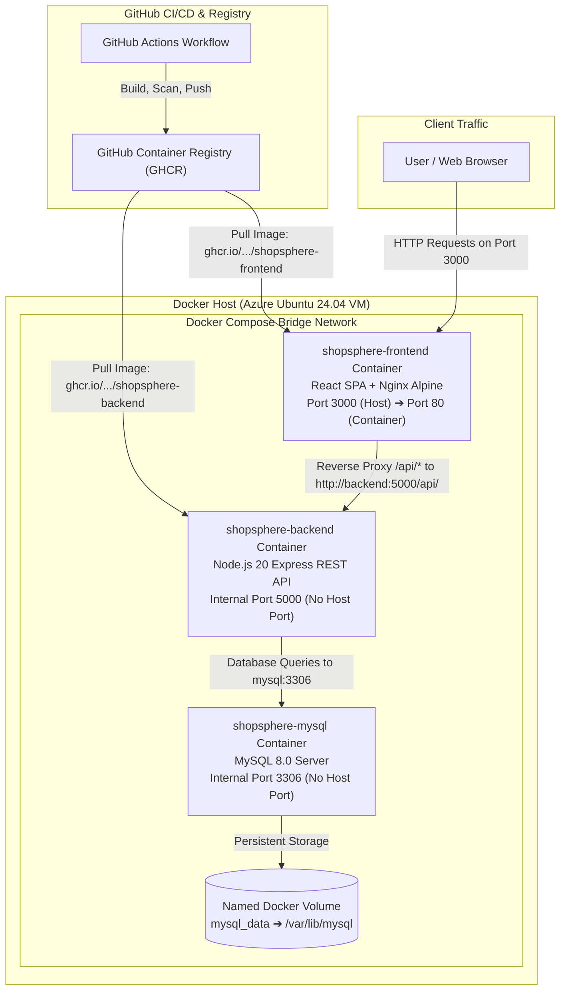

# 🐳 ShopSphere — Docker Documentation

This document describes the container architecture, multi-stage image builds, service orchestration, internal networking, and runtime configurations for **ShopSphere**.

---

## 1. Docker Overview

ShopSphere is structured as a containerized, three-tier cloud-native application:

- **Frontend Container**: React 18 Single Page Application built with Vite and served by Nginx Alpine.
- **Backend Container**: Node.js 20 and Express.js REST API running inside a hardened, unprivileged container.
- **Database Container**: MySQL 8.0 relational database with transactional volume persistence.

### Role of Docker in ShopSphere:
- **Reproducible Environments**: Eliminates "works on my machine" discrepancies across local development workstations and cloud production servers.
- **Service Isolation**: Each tier runs in its own isolated user-space container with segregated dependencies, environment variables, and filesystem boundaries.
- **Portable Packaging**: Self-contained images bundle application code, runtimes, and system libraries, deployable across any Docker-compatible infrastructure.
- **Declarative Orchestration**: **Docker Compose** orchestrates container startup dependencies, health monitoring, persistent volumes, and inter-service networking through a single declarative configuration file.

---

## 2. Docker Architecture

The following diagram illustrates the relationship between external clients, containerized tiers, persistent storage, and the continuous image delivery pipeline:



---

## 3. Docker Compose Services

The multi-container stack is declared in [docker-compose.yml](file:///e:/DevOps%20Coding/shopsphere-ecommerce/docker-compose.yml):

```yaml
services:

  mysql:
    image: mysql:8.0
    container_name: shopsphere-mysql
    restart: unless-stopped
    environment:
      MYSQL_ROOT_PASSWORD: ${MYSQL_ROOT_PASSWORD}
      MYSQL_DATABASE: ${MYSQL_DATABASE}
      MYSQL_USER: ${DB_USER}
      MYSQL_PASSWORD: ${DB_PASSWORD}
    volumes:
      - mysql_data:/var/lib/mysql
      - ./database/schema.sql:/docker-entrypoint-initdb.d/schema.sql:ro
    healthcheck:
      test:
        [
          "CMD",
          "mysqladmin",
          "ping",
          "-h",
          "localhost",
          "-uroot",
          "-p${MYSQL_ROOT_PASSWORD}"
        ]
      interval: 5s
      timeout: 5s
      retries: 10

  backend:
    image: ghcr.io/ayan-2023/shopsphere-backend:latest
    container_name: shopsphere-backend
    restart: unless-stopped
    environment:
      PORT: 5000
      DB_HOST: mysql
      DB_PORT: 3306
      DB_USER: ${DB_USER}
      DB_PASSWORD: ${DB_PASSWORD}
      DB_NAME: ${MYSQL_DATABASE}
      JWT_SECRET: ${JWT_SECRET}
      JWT_EXPIRES_IN: ${JWT_EXPIRES_IN}
    depends_on:
      mysql:
        condition: service_healthy

  frontend:
    image: ghcr.io/ayan-2023/shopsphere-frontend:latest
    container_name: shopsphere-frontend
    restart: unless-stopped
    ports:
      - "${FRONTEND_PORT}:80"
    depends_on:
      backend:
        condition: service_started

volumes:
  mysql_data:
```

### Detailed Service Breakdown:

### 1. `mysql` Service
- **Image**: `mysql:8.0` (official Oracle MySQL image from Docker Hub).
- **Container Name**: `shopsphere-mysql`.
- **Restart Policy**: `unless-stopped`.
- **Environment Variables**:
  - `MYSQL_ROOT_PASSWORD`: Administrative root password.
  - `MYSQL_DATABASE`: Initial database schema name (`shopsphere`).
  - `MYSQL_USER`: Application database user (`${DB_USER}`).
  - `MYSQL_PASSWORD`: Application database password (`${DB_PASSWORD}`).
- **Volume Mounts**:
  - `mysql_data:/var/lib/mysql`: Named persistent volume storing the database data directory.
  - `./database/schema.sql:/docker-entrypoint-initdb.d/schema.sql:ro`: Mounts the schema and seed data SQL dump into the container's standard initialization directory as read-only.
- **Healthcheck**: Uses `mysqladmin ping` every 5 seconds with a 5-second timeout and 10 retries to verify that MySQL is accepting socket connections.
- **Port Isolation**: No ports are published to the host machine. The database communicates only via internal container networking on port `3306`.

### 2. `backend` Service
- **Image**: `ghcr.io/ayan-2023/shopsphere-backend:latest` (pulled from GitHub Container Registry).
- **Container Name**: `shopsphere-backend`.
- **Restart Policy**: `unless-stopped`.
- **Environment Variables**:
  - `PORT: 5000`: Internal HTTP listening port for Express.
  - `DB_HOST: mysql`: Resolves the database container by its Docker Compose service name.
  - `DB_PORT: 3306`: Internal MySQL connection port.
  - `DB_USER`: Application database username.
  - `DB_PASSWORD`: Application database password.
  - `DB_NAME`: Target database name.
  - `JWT_SECRET`: Secret key used to sign and verify JWT tokens.
  - `JWT_EXPIRES_IN`: JWT expiration lifespan (e.g., `7d`).
- **Startup Dependency**: Configured with `depends_on.mysql` requiring `condition: service_healthy`. The backend will not boot until MySQL passes its healthcheck probe.
- **Port Isolation**: No ports are exposed to the VM host. The backend is reachable only by other containers inside the Docker bridge network on port `5000`.

### 3. `frontend` Service
- **Image**: `ghcr.io/ayan-2023/shopsphere-frontend:latest` (pulled from GitHub Container Registry).
- **Container Name**: `shopsphere-frontend`.
- **Restart Policy**: `unless-stopped`.
- **Port Mapping**: `${FRONTEND_PORT}:80` (maps host port `3000` to Nginx internal port `80`).
- **Startup Dependency**: Configured with `depends_on.backend` requiring `condition: service_started`.
- **Role**: Serves compiled React assets directly and reverse-proxies `/api/` calls to `http://backend:5000/api/`.

---

## 4. Frontend Dockerfile ⚛️

The frontend container uses a multi-stage Docker build defined in [frontend/Dockerfile](file:///e:/DevOps%20Coding/shopsphere-ecommerce/frontend/Dockerfile):

```dockerfile
# Stage 1: Build React application
FROM node:20-alpine AS build

# Working directory
WORKDIR /app

# Copy package files
COPY package*.json ./

# Install dependencies
RUN npm ci

# Copy frontend source code
COPY . .

# Create production build
RUN npm run build


# Stage 2: Serve application with Nginx
FROM nginx:alpine

RUN apk update && apk upgrade

# Remove default Nginx files
RUN rm -rf /usr/share/nginx/html/*

# Copy React production build
COPY --from=build /app/dist /usr/share/nginx/html

# Copy custom Nginx configuration
COPY nginx.conf /etc/nginx/conf.d/default.conf

# Expose HTTP port
EXPOSE 80

# Start Nginx
CMD ["nginx", "-g", "daemon off;"]
```

### Stage-by-Stage Instruction Breakdown:

#### Stage 1: Build (`AS build`)
1. `FROM node:20-alpine AS build`: Initializes an Alpine-based Node.js 20 build environment.
2. `WORKDIR /app`: Sets the working directory to `/app`.
3. `COPY package*.json ./`: Copies `package.json` and `package-lock.json` separately to leverage Docker layer caching for dependency installation.
4. `RUN npm ci`: Performs a clean, reproducible installation of exact dependencies from `package-lock.json`.
5. `COPY . .`: Copies the remaining frontend application source code.
6. `RUN npm run build`: Executes the Vite build script, compiling JSX and styles into optimized, static production files inside `/app/dist`.

#### Stage 2: Production Runtime
1. `FROM nginx:alpine`: Employs an ultra-lightweight Nginx Alpine base image (~20MB).
2. `RUN apk update && apk upgrade`: Applies the latest security patches to the Alpine base system.
3. `RUN rm -rf /usr/share/nginx/html/*`: Clears default Nginx static index files.
4. `COPY --from=build /app/dist /usr/share/nginx/html`: Copies solely the compiled production bundle from Stage 1, leaving behind `node_modules`, source code, and Vite build tooling.
5. `COPY nginx.conf /etc/nginx/conf.d/default.conf`: Injects the custom Nginx reverse proxy configuration.
6. `EXPOSE 80`: Documents that the web server listens on port `80`.
7. `CMD ["nginx", "-g", "daemon off;"]`: Runs Nginx in the foreground to keep the container process active.

---

## 5. Backend Dockerfile 🟢

The backend container uses a hardened, multi-stage Docker build in [backend/Dockerfile](file:///e:/DevOps%20Coding/shopsphere-ecommerce/backend/Dockerfile):

```dockerfile
# Stage 1: Install production dependencies
FROM node:20-alpine AS dependencies

WORKDIR /app

COPY package*.json ./

RUN npm ci --omit=dev


# Stage 2: Production backend
FROM node:20-alpine

WORKDIR /app

ENV NODE_ENV=production
RUN apk update && apk upgrade
RUN rm -rf /usr/local/lib/node_modules/npm

COPY --from=dependencies /app/node_modules ./node_modules
COPY package*.json ./
COPY src ./src

# Run application as non-root user
USER node

EXPOSE 5000

CMD ["node", "src/server.js"]
```

### Stage-by-Stage Instruction Breakdown:

#### Stage 1: Dependencies (`AS dependencies`)
1. `FROM node:20-alpine AS dependencies`: Uses Node.js 20 Alpine to resolve dependencies.
2. `WORKDIR /app`: Defines the working directory.
3. `COPY package*.json ./`: Copies package manifest files.
4. `RUN npm ci --omit=dev`: Installs only production dependencies, omitting `devDependencies` (such as `nodemon`) to keep the production layer minimal.

#### Stage 2: Production Runtime
1. `FROM node:20-alpine`: Uses a clean Node.js 20 Alpine image.
2. `ENV NODE_ENV=production`: Configures Node.js and Express to run in production mode (enabling internal caching and disabling verbose stack traces).
3. `RUN apk update && apk upgrade`: Updates base Alpine packages to resolve known vulnerabilities.
4. `RUN rm -rf /usr/local/lib/node_modules/npm`: **Hardening step** — completely removes `npm` binaries from the production container to prevent attackers from executing package installs in the event of an exploit.
5. `COPY --from=dependencies /app/node_modules ./node_modules`: Copies pre-installed production `node_modules` from Stage 1.
6. `COPY package*.json ./` and `COPY src ./src`: Copies the application source code.
7. `USER node`: **Hardening step** — drops root privileges and executes as the unprivileged `node` user (UID 1000).
8. `EXPOSE 5000`: Documents internal container listening port.
9. `CMD ["node", "src/server.js"]`: Starts the Express server directly via Node.js.

---

## 6. Nginx Reverse Proxy Configuration 🔀

The frontend container embeds a custom [nginx.conf](file:///e:/DevOps%20Coding/shopsphere-ecommerce/frontend/nginx.conf):

```nginx
server {
    listen 80;
    server_name _;

    root /usr/share/nginx/html;
    index index.html;

    location /api/ {
        proxy_pass http://backend:5000/api/;

        proxy_http_version 1.1;

        proxy_set_header Host $host;
        proxy_set_header X-Real-IP $remote_addr;
        proxy_set_header X-Forwarded-For $proxy_add_x_forwarded_for;
        proxy_set_header X-Forwarded-Proto $scheme;
    }

    location / {
        try_files $uri $uri/ /index.html;
    }

    location /images/ {
        try_files $uri =404;
    }
}
```

### Architectural Behavior:
- **/api/***: Forwards API calls to `http://backend:5000/api/`. Nginx passes client IP and protocol headers (`X-Real-IP`, `X-Forwarded-For`, `X-Forwarded-Proto`) to ensure the Express backend can accurately determine client IP addresses for rate limiting.
- **/**: Single Page Application routing. Attempts to serve files directly via `$uri` or `$uri/`. If the file does not exist, it falls back to `/index.html`, allowing `react-router-dom` to handle client-side routing seamlessly without 404 errors on page refreshes.
- **/images/**: Serves static assets directly with an explicit `=404` fallback.
- **Docker Compose DNS Resolution**: The directive `proxy_pass http://backend:5000/api/;` works because Docker Compose provides an embedded DNS server at `127.0.0.11` that automatically maps the service name `backend` to the internal IP address of the `shopsphere-backend` container.

---

## 7. Data Persistence & Named Volumes 💾

Relational database records are preserved across container lifecycle operations using a named Docker volume:

```yaml
volumes:
  mysql_data:
```

### How Persistence Works:
1. When `shopsphere-mysql` boots, Docker mounts the host-managed `mysql_data` volume to `/var/lib/mysql`.
2. On initial startup, MySQL detects an empty volume and executes `./database/schema.sql` (mounted into `/docker-entrypoint-initdb.d/`).
3. Subsequent container restarts (`docker compose down` followed by `docker compose up -d`) re-mount the existing `mysql_data` volume. MySQL detects an existing data directory and skips initialization, preserving all catalog updates, customer accounts, and order histories.
4. To completely reset the database to initial seed data, the volume must be explicitly purged:
   ```bash
   docker compose down -v
   docker compose up -d
   ```

---

## 8. Networking & Service Discovery 🌐

When Docker Compose starts the application, it creates an isolated default bridge network (typically named `shopsphere-ecommerce_default`):

```
+-----------------------------------------------------------------------------------------+
|                    DOCKER COMPOSE BRIDGE NETWORK (shopsphere-default)                   |
|                                                                                         |
|  +--------------------+         +--------------------+         +---------------------+  |
|  | shopsphere-frontend|         | shopsphere-backend |         |  shopsphere-mysql   |  |
|  | IP: 172.20.0.4     |         | IP: 172.20.0.3     |         |  IP: 172.20.0.2     |  |
|  | Port: 80           |         | Port: 5000         |         |  Port: 3306         |  |
|  +---------+----------+         +---------+----------+         +----------+----------+  |
|            |                              |                               |             |
|            +--- http://backend:5000/api --+                               |             |
|                                           +--- mysql:3306 ----------------+             |
+-----------------------------------------------------------------------------------------+
             ▲
             | Port 3000:80 (Host Port Binding)
             |
       [ VM Host Ingress ]
```

### Network Characteristics:
- **Automatic Service Discovery**: Containers resolve each other using their Docker Compose service names (`mysql`, `backend`, `frontend`).
- **Internal Only**: `backend` and `mysql` containers do not declare a `ports:` block in `docker-compose.yml`. As a result, neither service binds to host network interfaces, eliminating external port exposure.
- **Single Public Port**: Only `frontend` declares a `ports:` block (`${FRONTEND_PORT}:80`), exposing port `3000` as the sole entry point.

---

## 9. Docker Security Best Practices Implemented 🛡️

ShopSphere incorporates multiple container security controls:

| Security Practice | Implementation in ShopSphere | Benefit |
| :--- | :--- | :--- |
| **Multi-Stage Builds** | Implemented in both `frontend/Dockerfile` and `backend/Dockerfile` | Separates compile-time dependencies from production images, resulting in minimal image sizes. |
| **Unprivileged Execution** | `USER node` in `backend/Dockerfile` | Prevents container breakout vulnerabilities from executing as host root. |
| **Toolchain Pruning** | `RUN rm -rf /usr/local/lib/node_modules/npm` | Removes runtime package managers from the backend container, denying attackers tools to install malicious payloads. |
| **Production-Only Deps** | `npm ci --omit=dev` | Excludes devDependencies (like linters and nodemon) from the production image. |
| **Minimal Base Images** | `node:20-alpine` and `nginx:alpine` | Minimizes attack surface and reduces known CVE surface area compared to full Debian/Ubuntu images. |
| **Port Exposure Reduction** | DB and Backend ports unmapped | Protects MySQL (3306) and Express (5000) from unauthorized external network access. |
| **Pre-Release Scanning** | Aqua Trivy vulnerability scanning in CI/CD | Fails builds on unpatched `HIGH` or `CRITICAL` vulnerabilities before publishing images to GHCR. |

---

## 10. Container Management & Useful Commands 🔧

### Common Docker Compose Operations
```bash
# Start all services in the background
docker compose up -d

# Check running container statuses and health
docker compose ps

# View live aggregate logs
docker compose logs -f

# View logs for a specific service
docker compose logs -f backend
docker compose logs -f frontend
docker compose logs -f mysql

# Stop all containers while preserving database volume
docker compose down

# Stop all containers and wipe persistent database volume
docker compose down -v

# Force pull latest images from GHCR and recreate services
docker compose pull backend frontend
docker compose up -d --force-recreate backend frontend
```

### Interactive Debugging Commands
```bash
# Open an interactive shell inside the backend container
docker compose exec backend sh

# Open an interactive shell inside the frontend Nginx container
docker compose exec frontend sh

# Open MySQL interactive command-line client
docker compose exec mysql mysql -u shopsphere_app -p shopsphere

# Inspect Docker bridge network details and connected IPs
docker network inspect shopsphere-ecommerce_default
```

---

## 11. Docker Troubleshooting 🧯

| Symptom | Probable Cause | Diagnostic Command & Fix |
| :--- | :--- | :--- |
| **MySQL container stuck in `(unhealthy)`** | Initialization script error or credentials mismatch | Check logs: `docker compose logs mysql`. Verify `MYSQL_ROOT_PASSWORD` in `.env`. Check disk space on VM: `df -h`. |
| **Backend exits immediately (`exit code 1`)** | Database connection refused or missing env var | Check logs: `docker compose logs backend`. Confirm `mysql` container is reporting `(healthy)`. Verify `.env` database parameters. |
| **Frontend displays `502 Bad Gateway`** | Backend service is unreachable from Nginx | Verify backend is running: `docker compose ps`. Test internal communication: `docker compose exec frontend wget -qO- http://backend:5000/api/health`. |
| **Port `3000` already in use** | Another process is bound to host port `3000` | Identify process: `sudo netstat -tulpn \| grep 3000`. Adjust `FRONTEND_PORT` in `.env` to an alternate available port (e.g., `8080`). |
| **Database changes not reflecting after schema edit** | Named volume already initialized with older schema | Rebuild the volume: `docker compose down -v` followed by `docker compose up -d`. |
| **Image pull error (`403 Forbidden` / `404`)** | GHCR image visibility or permission issue | Verify the image name matches `ghcr.io/ayan-2023/shopsphere-*` and packages have public visibility or valid GHCR login credentials. |

---

## 12. Docker Architecture Summary

ShopSphere utilizes a container architecture engineered for predictability and security:

$$\text{Multi-Stage Alpine Builds} + \text{USER node} + \text{Pruned npm} + \text{Internal Bridge Isolation} + \text{Nginx Reverse Proxy} + \text{Named Volume Persistence}$$

This design guarantees that every layer of the application is isolated, lightweight, secure, and ready for deployment on any container host.
